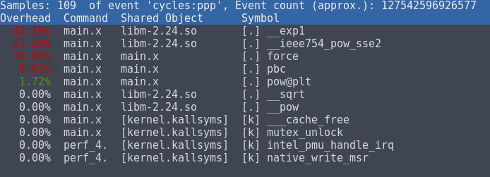
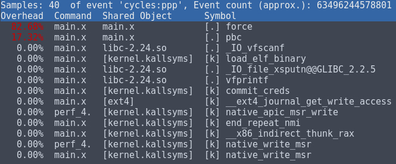

### Collaborative project on MD code optimization (Group 4) 

##### Team members: Alberto Cazzaniga, Celia Laurent, Antonio Sciarappa, Miguel Castellano.

#### 1. Introduction

For this project, we're given a simplified code to run molecular dynamics simulations in C and the goal is to implement a python interface along with a series of optimizations including parallelization schemes for MPI and OpenMP in a collaborative way, using continuous integration. 

#### 2. Work

The work developed during the project can be split in two parts: The realization of a Python interface in charge of calling the time-critical functions from C and the implementation of a bunch of optimizations to speed up the code plus the addition of both an MPI and OpenMP parallelization schemes aimed at providing a certain sense of scalability. 

For the first part, we wrote a python script that acted as an interface to the C code by implementing the same C functions in Python and calling only the time-critical functions from C by making use of ctypes and shared library handles.

For the second part, distributed memory parallelization was added by means of MPI directives into the code while shared memory multi-threading was enabled in a peculiar, more performant but also more memory consuming way using OpenMP pragmas. As for the optimizations, we implemented the in-lining of frequently called functions, re-formulation of expensive mathematical operations, vectorization and others.

#### 3. Timing parallel application

We run our hybrid C code on the Galileo cluster in Bologna. The times obtained for Argon with 2916 atoms are summarized in the following plot:


The timings seems to scale well across various values for number of MPI processes and OPENMP threads. The best performance obtained reached a speedup of **x50.7** with respect to the serial code run with appropriate gcc flags.

Unfortunately we did not have time to run the Python code on the cluster, but the timing on our laptops and Travis are not too far from the C results.

#### 4. Optimization


We follow the optimisation strategies suggested. We briefly comment the results obtained in the various phases. All the profiling has been run on a Intel(R) Core(TM) i7-7500U CPU @ 2.70GHz machine, with dual core and hyperthreading disabled.

##### Choice of optimization flags

COMPILATION FLAGS: flag -O0 

*2916 atoms*

```
 Performance counter stats for '../main.x':

     433871.496417      task-clock (msec)         #    1.000 CPUs utilized          
               974      context-switches          #    0.002 K/sec                  
                 0      cpu-migrations            #    0.000 K/sec                  
               116      page-faults               #    0.000 K/sec                  
 1,176,366,484,257      cycles                    #    2.711 GHz                    
 1,950,828,589,891      instructions              #    1.66  insn per cycle         
   289,550,927,463      branches                  #  667.366 M/sec                  
     5,500,650,759      branch-misses             #    1.90% of all branches        

     433.942273773 seconds time elapsed
```

*108 atoms*



COMPILATION FLAGS: flag -O3 

*2916 atoms*

```
 Performance counter stats for '../main.x':

     278984.438294      task-clock (msec)         #    0.999 CPUs utilized          
             2,963      context-switches          #    0.011 K/sec                  
                 6      cpu-migrations            #    0.000 K/sec                  
               117      page-faults               #    0.000 K/sec                  
   757,179,241,778      cycles                    #    2.714 GHz                    
 1,163,915,527,983      instructions              #    1.54  insn per cycle         
   212,975,057,562      branches                  #  763.394 M/sec                  
     5,534,779,899      branch-misses             #    2.60% of all branches        

     279.137268749 seconds time elapsed
```

*108 atoms*


COMPILATION FLAGS: flags -O3 -fast-math 

*2916 atoms*

```
 Performance counter stats for '../main.x':

     142066.105954      task-clock (msec)         #    1.000 CPUs utilized          
             1,532      context-switches          #    0.011 K/sec                  
                 1      cpu-migrations            #    0.000 K/sec                  
               111      page-faults               #    0.001 K/sec                  
   395,643,227,013      cycles                    #    2.785 GHz                    
   573,591,518,431      instructions              #    1.45  insn per cycle         
   134,624,266,700      branches                  #  947.617 M/sec                  
     5,047,908,206      branch-misses             #    3.75% of all branches        

     142.095114883 seconds time elapsed
```

*108 atoms*



COMPILATION FLAGS: flags -O3 -fast-math -fexpensive-optimizations -msse3 

*2916 atoms*

```
 Performance counter stats for '../main.x':

     146215.400008      task-clock (msec)         #    1.000 CPUs utilized          
               352      context-switches          #    0.002 K/sec                  
                 1      cpu-migrations            #    0.000 K/sec                  
               111      page-faults               #    0.001 K/sec                  
   395,023,649,053      cycles                    #    2.702 GHz                    
   573,520,577,101      instructions              #    1.45  insn per cycle         
   134,610,546,999      branches                  #  920.632 M/sec                  
     5,048,645,224      branch-misses             #    3.75% of all branches        

     146.265948840 seconds time elapsed
```

- Total improvement via compilation flags: **3x speedup**
- After a quick benchmark we thus drop the flag -fexpensive-optimization
- In general instruction per cycle decrease or stay constant but increase in performance as better optimized set of instructions.

##### Inlining

INLINING, flags -O3 -ffast-math 

*2916 atoms*

```
 Performance counter stats for '../main.x':

     107131.233277      task-clock (msec)         #    0.999 CPUs utilized          
               361      context-switches          #    0.003 K/sec                  
                 0      cpu-migrations            #    0.000 K/sec                  
               113      page-faults               #    0.001 K/sec                  
   289,440,674,432      cycles                    #    2.702 GHz                    
   415,649,532,734      instructions              #    1.44  insn per cycle         
    83,548,308,780      branches                  #  779.869 M/sec                  
     4,988,981,154      branch-misses             #    5.97% of all branches        

     107.204632344 seconds time elapsed
```

*108 atoms*


- inlined function ```pbc``` by moving directly code to ```force.c``` file containing force computation, adding ```static inline __attribute__((always_inline))``` intrinsic.
- inlining is clearly succesful from perf output.
- reach **x4 speedup**.

##### Newton optimization

NEWTON, flags -O3 -ffast-math 

*2916 atoms*

```
 Performance counter stats for '../main.x':

      41109.016353      task-clock (msec)         #    0.998 CPUs utilized          
               345      context-switches          #    0.008 K/sec                  
                 3      cpu-migrations            #    0.000 K/sec                  
               113      page-faults               #    0.003 K/sec                  
   129,811,329,619      cycles                    #    3.158 GHz                    
   186,924,585,321      instructions              #    1.44  insn per cycle         
    37,786,495,566      branches                  #  919.178 M/sec                  
     2,270,430,631      branch-misses             #    6.01% of all branches        

      41.175206592 seconds time elapsed
```

*108 atoms*


- reached **x10 speedup**.
- From now on leave coarse grain perf description. At this stage only concentrate on force to obtain further speedup.


##### Reduce math operations

REDUCE MATH, flags -O3 -ffast-math (2916 atoms) 

```
 Performance counter stats for '../main.x':

      37065.530900      task-clock (msec)         #    0.999 CPUs utilized          
               414      context-switches          #    0.011 K/sec                  
                 0      cpu-migrations            #    0.000 K/sec                  
               111      page-faults               #    0.003 K/sec                  
   123,696,434,839      cycles                    #    3.337 GHz                    
   179,980,425,327      instructions              #    1.46  insn per cycle         
    37,783,649,722      branches                  # 1019.374 M/sec                  
     2,295,663,086      branch-misses             #    6.08% of all branches        

      37.093193418 seconds time elapsed
```

- Avoid use of powers, sqrt and divisions.

- Improvement can be seen in aasembly of perf output.

- reach **x11.6 speedup**.

  ****

**After OMP pragma instruction and code adaptation** (run with no -fopenp flag)

BEFORE LAST OPTIMIZATION LAYER 

*2916 atoms*

```
Evolve time: 35.109601

 Performance counter stats for '../main.x':

      35581.172046      task-clock (msec)         #    0.999 CPUs utilized          
               185      context-switches          #    0.005 K/sec                  
                 5      cpu-migrations            #    0.000 K/sec                  
               113      page-faults               #    0.003 K/sec                  
   124,187,773,089      cycles                    #    3.490 GHz                    
   147,673,667,736      instructions              #    1.19  insn per cycle
       127,453,310      cache-references                                            
         8,434,924      cache-misses              #    6.618 % of all cache refs  
    37,782,300,161      branches                  # 1061.862 M/sec                  
     2,260,307,183      branch-misses             #    5.98% of all branches        

      35.603604495 seconds time elapsed

```

BEFORE LAST OPTIMIZATION LAYER 

*108 atoms*

```
Evolve time: 1.100160

Performance counter stats for '../main.x':

       1121.006401      task-clock (msec)         #    0.999 CPUs utilized          
                 9      context-switches          #    0.008 K/sec                  
                 0      cpu-migrations            #    0.000 K/sec                  
                64      page-faults               #    0.057 K/sec                  
     3,818,553,519      cycles                    #    3.406 GHz                    
     2,960,165,769      instructions              #    0.78  insn per cycle
         1,724,978      cache-references                                            
           910,551      cache-misses              #   52.786 % of all cache refs 
       560,551,149      branches                  #  500.043 M/sec                  
        87,191,783      branch-misses             #   15.55% of all branches        

       1.122353338 seconds time elapsed

```

- adapted our optimizations to the openmpi layer. Unexpectedly get a further speedup given reducing number of instructions. 
- reached **x12.1 speedup**

##### Last optimization

We try to improve possibilities of having vectorization and make use of spatial locality by creating two temporary buffers (one for positions R and one for forces F) inside the force function, see files ```force.c``` and ```force_mpi.c``` in ```ljmd-c/src/new``` forlder. Further improvement could be given by changing the all data structure sys, but due to time constraint we leave this for future work.

AFTER LAST OPTIMIZATION LAYER 

*108 atoms*

```
Evolve time: 1.081362

Performance counter stats for '../main.x':

       1099.120589      task-clock (msec)         #    0.999 CPUs utilized          
                 8      context-switches          #    0.007 K/sec                  
                 1      cpu-migrations            #    0.001 K/sec                  
            12,798      page-faults               #    0.012 M/sec                  
     3,739,226,030      cycles                    #    3.402 GHz                    
     2,629,548,032      instructions              #    0.70  insn per cycle         
         4,951,491      cache-references                                            
         2,514,690      cache-misses              #   50.787 % of all cache refs
       568,839,950      branches                  #  517.541 M/sec                  
        90,690,447      branch-misses             #   15.94% of all branches        

       1.100490502 seconds time elapsed

```


AFTER LAST OPTIMIZATION LAYER 

*2916 atoms*

```
Evolve time: 31.132160

 Performance counter stats for '../main.x':

      31624.351582      task-clock (msec)         #    1.000 CPUs utilized          
                55      context-switches          #    0.002 K/sec                  
                 2      cpu-migrations            #    0.000 K/sec                  
            34,327      page-faults               #    0.001 M/sec                  
   110,329,150,159      cycles                    #    3.489 GHz                    
   121,692,644,085      instructions              #    1.10  insn per cycle
       109,657,647      cache-references                                            
        13,907,178      cache-misses              #   12.682 % of all cache refs
    37,802,268,600      branches                  # 1195.353 M/sec                  
     2,328,234,384      branch-misses             #    6.16% of all branches        

      31.627499914 seconds time elapsed

```

- reduce further the number of instructions. Slightly lower instruction per cycle but still a good value.
- we reach a **x13.7 speedup**.

##### OMP compatibility of last optimisation

BEFORE LAST OPT, with OMP_NUM_THREADS=2

(Hyperthreading disabled on my machine less performance)

```
Evolve time: 19.977002
Simulation Done.

 Performance counter stats for '../main.x':

      40083.017528      task-clock (msec)         #    1.953 CPUs utilized          
             2,683      context-switches          #    0.067 K/sec                  
                 1      cpu-migrations            #    0.000 K/sec                  
               148      page-faults               #    0.004 K/sec                  
   128,850,228,838      cycles                    #    3.215 GHz                    
   147,977,660,258      instructions              #    1.15  insn per cycle
        77,857,770      cache-references                                            
        12,095,369      cache-misses              #   15.535 % of all cache refs 
    37,860,212,003      branches                  #  944.545 M/sec                  
     2,272,772,703      branch-misses             #    6.00% of all branches        

      20.526552651 seconds time elapsed


```

- reach **x21.1 speedup**  with **two cores** before last optimisation.

AFTER LAST OPT. OMP_NUM_THREADS=2

(Hyperthreading disabled on my machine less performance)

```
Evolve time: 17.026178
Simulation Done.

 Performance counter stats for '../main.x':

      34135.812936      task-clock (msec)         #    1.944 CPUs utilized          
             3,384      context-switches          #    0.099 K/sec                  
                 3      cpu-migrations            #    0.000 K/sec                  
            52,280      page-faults               #    0.002 M/sec                  
   118,627,998,083      cycles                    #    3.475 GHz                    
   134,784,564,238      instructions              #    1.14  insn per cycle 
       100,175,745      cache-references                                            
        17,937,006      cache-misses              #   17.906 % of all cache refs
    37,879,590,001      branches                  # 1109.673 M/sec                  
     2,388,623,352      branch-misses             #    6.31% of all branches        

      17.556866156 seconds time elapsed
```

- reach **x24.7 speedup** with **two cores** with respect to initial code after last optimisation.

##### MPI compatibility of last optimisation

MPI COMPATIBILITY (2916 atoms): BEFORE LAST OPT. MPI_NUM_PROC=2

(Hyperthreading disabled on my machine less performance)

NOTE: instrumented c file ```main_mpi.c``` for measuring force function.

```
Time process 1: 20.921596
Time process 0: 20.428976
Evolve time: 20.921596
```

- reach **x20.7 speedup** with **two MPI processes** with respect to initial code before last optimisation.

MPI COMPATIBILITY (2916 atoms): MPI_NUM_PROC=2

(Hyperthreading disabled on my machine less performance)

```
Time process 1: 18.457735
Time process 0: 17.993986
Evolve time: 18.457735
```

- reach **x23.5 speedup** with **two MPI processes** with respect to initial code.

